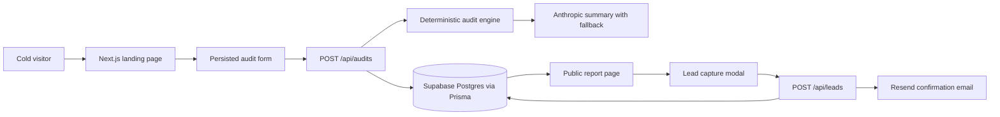

# Architecture

## System Diagram

## Data Flow

A user enters team size, stage, primary use case, selected tools, plans, seats, monthly spend, and API usage. `POST /api/audits` validates the payload with Zod, runs deterministic recommendations in `lib/audit-engine`, asks Anthropic for a short personalized summary, falls back to a template if needed, stores the report in Postgres, and returns a public slug. `/report/[slug]` reads only sanitized audit fields and renders charts, recommendations, and lead capture.

## Stack Reasoning

Next.js App Router gives server-rendered marketing/report pages, route handlers, metadata, sitemap, and Vercel deployment in one project. Prisma adds schema discipline on Supabase Postgres. Zustand plus localStorage keeps the multi-step form resilient across reloads. Recharts is enough for the MVP dashboard without adding a heavier analytics layer. Framer Motion and Tailwind support a premium UI without a prebuilt dashboard template.

## Scaling to 10k Audits per Day

Move LLM summary and email sending to a queue, cache public reports at the edge, add durable rate limiting through Upstash or Supabase, separate analytics writes from the request path, add Postgres indexes on `slug` and `created_at`, and store normalized pricing versions so historical reports remain reproducible after vendor prices change.

