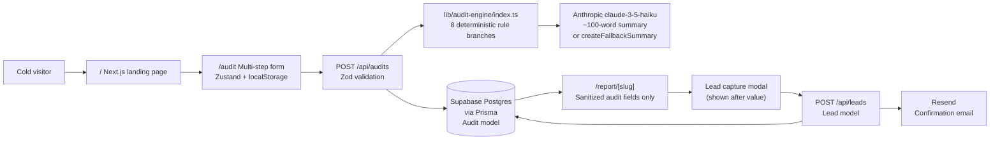

# Architecture

## System Diagram

## Data Flow

1. **Form** (`/audit`) — user selects tools, plans, seats, monthly spend, usage intensity, team size, stage, and primary use case. Zustand stores each step in `localStorage` so the form survives reloads.
2. **`POST /api/audits`** — Zod validates the payload against the `AuditInput` schema in `types/audit.ts`. The engine runs, Anthropic is called for the summary (with fallback), and the result is written to the `Audit` table. The route returns `{ slug }`.
3. **`/report/[slug]`** — reads the `Audit` row. The query explicitly selects only audit fields; `Lead` records are never fetched. Recharts renders savings charts. The lead capture modal is revealed after the report section is visible.
4. **`POST /api/leads`** — writes name, email, company, role, and audit slug to the `Lead` table. Triggers a Resend transactional email. The `Audit` record is not mutated.

## Deterministic Audit Rules (`lib/audit-engine/index.ts`)

| Rule | Trigger condition | Recommended action |
|------|------------------|--------------------|
| Cursor Business → Pro | `plan === "Business" && seats < 5` | Downgrade, saves `(seats × $40) − (seats × $20)` |
| ChatGPT Team → Plus | `plan === "Team" && seats <= 2` | Downgrade, saves `(seats × $30) − (seats × $20)` |
| Gemini Ultra → Pro | `plan === "Ultra" && usageIntensity === "low"` | Downgrade, saves `$200 − $19.99` per seat |
| OpenAI API → Claude Max | `id === "openai-api" && spend > $500 && useCase === "writing"` | Switch + cap, targets 45 % reduction |
| Anthropic API → batch/cache | `id === "anthropic-api" && spend > $750 && intensity !== "low"` | Credit optimization, targets 28 % reduction |
| GitHub Copilot Enterprise → Business | `plan === "Enterprise" && seats < 10` | Downgrade, saves `(seats × $39) − (seats × $19)` |
| Windsurf Teams → Pro | `plan === "Teams" && seats < 4` | Downgrade, saves `(seats × $30) − (seats × $15)` |
| High-spend catch-all | `monthlySpend > $1,000` | Credex credits / negotiated rates, targets 22 % reduction |

`clampSavings` ensures savings can never be negative. `withSavings` demotes action to `"monitor"` if the optimized cost exceeds the user's self-reported spend (prevents false recommendations when the user's actual bill includes discounts or credits).

## Stack Reasoning

| Choice | Why |
|--------|-----|
| Next.js App Router | SSR for public report SEO, route handlers for API, single Vercel deployment |
| Prisma + Supabase | Typed schema migrations, Vercel edge-compatible connection pooling |
| Zustand + localStorage | Form survives page reloads without a backend session per user |
| Recharts | Sufficient for an MVP savings bar/pie chart; no dashboard-builder overhead |
| Resend | Simple transactional email API, generous free tier for MVP lead volume |
| Anthropic claude-3-5-haiku | Fast and cheap for a 100-word paragraph; deterministic engine does the math |
| Vitest | Zero-config TypeScript test runner; compatible with the Next.js tsconfig |

## Scaling to 10 k Audits per Day

- Move Anthropic call and Resend email to a background queue (e.g. Vercel Queue, Upstash QStash) to decouple API latency from the response.
- Add a `slug` index and a `createdAt` descending index to the `Audit` table.
- Cache public report pages at the Vercel edge (stale-while-revalidate) — report data is immutable after creation.
- Add Upstash Redis rate limiting on `POST /api/audits` (currently uses an in-memory `Map` in `lib/rate-limit.ts`).
- Normalize pricing into a versioned `PricingSnapshot` table so historical reports remain reproducible after vendor price changes.
- Add `ANALYZE` + `VACUUM` schedule on Supabase and separate analytics event writes from the audit write path.
